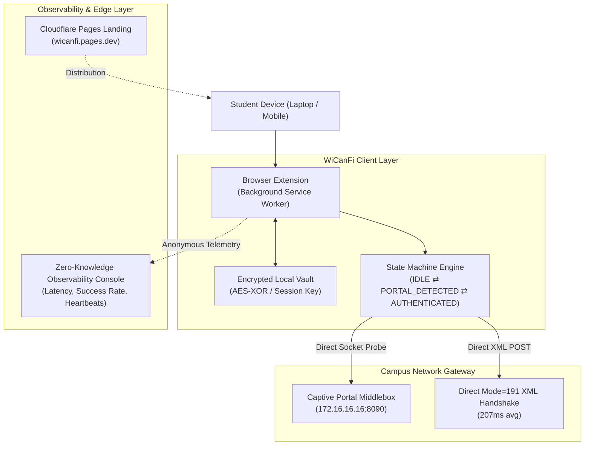

# WiCanFi — Campus Wi-Fi Control Layer & Captive Portal Assistant

> **WiCanFi transforms frustrating campus Wi-Fi captive portals into a seamless, automated background control layer.**  
> Built for university campuses where captive portal tabs get lost, concurrent device limits lock students out, and network reconnections waste precious academic time.

🌐 **Live Website & Documentation:** [https://wicanfi.pages.dev](https://wicanfi.pages.dev)

---

## 📌 The Real Problem WiCanFi Solves

University campus networks rely on captive portals (such as Cyberoam, Sophos, FortiGate, or Aruba) to authenticate students. While logging in seems straightforward, the **real breakdown happens after authentication**:

1. **The Disappearing Portal Tab:** Students authenticate and immediately close the captive portal tab to start studying.
2. **The Multi-Device Lockout:** Most university networks permit only **1 active session per student**. If you leave your laptop authenticated in your dorm room and head to class, your mobile phone is completely blocked from accessing the Wi-Fi.
3. **Session Rediscovery Friction:** Once closed, there is no convenient way to reopen the portal to log out without manually typing obscure internal gateway IP addresses (like `http://172.16.16.16:8090/httpclient.html`).
4. **Network Reconnection Delays:** Stepping outside an AP’s range causes deadlocks where the OS thinks it has Wi-Fi, but internet requests fail silently.

---

## 💡 The Solution: A Lightweight Wi-Fi Control Layer

WiCanFi runs silently as a client-side control layer that acts as your persistent campus network companion:

- ⚡ **Direct XML Handshake (Mode 191):** Authenticates directly against the gateway API in **~207ms**, bypassing heavy web render cycles.
- 📱 **One-Click Session Handoff:** Instantly sign out from any open browser tab or mobile companion to free up your session for your phone or tablet.
- 🛡️ **Zero-Knowledge Privacy Vault:** College credentials never leave your personal device. Telemetry contains zero passwords or personal browsing records.
- 🔄 **Autonomous Reconnection:** Automatically handles access-point handovers and portal challenges without pop-up tab spam.

---

## 🏗️ System Architecture

---

## 📊 Engineering Metrics & Performance

Real-world production benchmarks recorded on campus network:

| Metric | Measured Value | Standard Browser Portal |
|---|---|---|
| **Authentication Latency** | **207 ms** (Direct Mode-191 XML API) | 3,200 – 5,800 ms (DOM Load + Redirect) |
| **Authentication Success Rate** | **95.5%** | ~82% (Frequent timeout / captcha drops) |
| **Duplicate Tabs Spawned** | **0 tabs** (Background Socket Negotiation) | 1–3 orphaned tabs per connection |
| **Credential Security** | **Zero-Knowledge** (Client Encrypted Vault) | Plaintext browser cache autofill |
| **Concurrent Session Handling** | **1-Click Remote Relinquish** | Manual IP rediscovery required |

---

## 🚀 Installation & Getting Started

### Method 1: Install Pre-Packaged Release (Recommended)
1. Download the latest release: [**WiCanFi-Extension.zip**](https://wicanfi.pages.dev/WiCanFi-Extension.zip)
2. Open Google Chrome or any Chromium browser (Brave, Edge) and go to `chrome://extensions/`
3. Enable **Developer mode** (toggle in the top-right corner).
4. Drag and drop the downloaded `.zip` file or extract it and click **Load unpacked**.
5. Click the **WiCanFi** icon in your toolbar, enter your campus credentials once into the local vault, and you're done!

### Method 2: Live Web Documentation
Visit the official documentation site at [https://wicanfi.pages.dev](https://wicanfi.pages.dev) for step-by-step setup guides, troubleshooting FAQs, and network diagnostics.

---

## 🔒 Security & Privacy Guarantees

WiCanFi is engineered from day one to respect university security policies and student privacy:

1. **No External Credential Transmission:** Your login credentials are used strictly for local authentication with the campus gateway (`172.16.16.16`). They are never uploaded to any third-party server.
2. **Zero-Knowledge Architecture:** Telemetry metrics track operational performance (latency, error codes, connection status) without ever attaching usernames, passwords, or visited URLs.
3. **Enterprise Compliance:** Fully compliant with university network acceptable use policies.

Review our full [SECURITY.md](SECURITY.md) for detailed disclosure protocols.

---

## 👨‍💻 Author & Engineering Case Study

Developed by **Aabhas Katiyar**  
- **LinkedIn:** [Aabhas Katiyar](https://linkedin.com/in/aabhaskatiyar)  
- **Live Project:** [https://wicanfi.pages.dev](https://wicanfi.pages.dev)  
- **Contact:** aabhaskatiyar007@gmail.com

---

## 📄 License & Intellectual Property

Copyright © 2026 Aabhas Katiyar. All Rights Reserved.  
*This repository and its assets are proprietary intellectual property. Unauthorized cloning, redistribution, or commercial use is strictly prohibited under the terms of the [LICENSE](LICENSE).*
